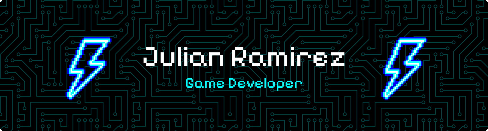

<h3 align="center">About me</h3>

✨ they/them

📍 Colombia  

🌐 English / Spanish / Italian 

🎓 Systems & Computer Engineering Student  

💕 Passionate about all things gamedev — gameplay systems, design, visuals, optimization, and player experience.

 

<h3 align="center">Languages ✨</h3>

  

  

  

 

<h3 align="center">Tools ⚔️</h3>

  

  

  

 

<h3 align="center">Favorite Games</h3>

🕹️ <b>Game Design:</b> Balatro, Ultrakill, Hollow Knight

👁️ <b>Visual Design:</b> Hollow Knight: Silksong, Hades, Disco Elysium  

🔧 <b>Game Mechanics:</b> Portal (1 and 2), Superhot, Robobeat 

 
